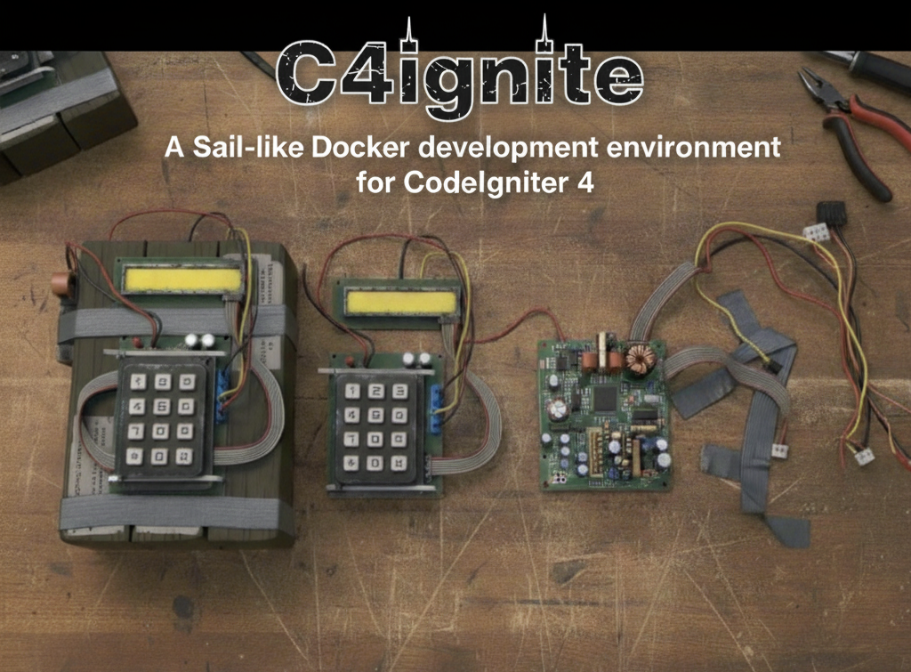

---

## Toolkit santai buat ngerjain CodeIgniter 4 dengan rasa Laravel Sail.

- Jalankan `./scripts/c4ignite init` biar skeleton CI4 (AppStarter) nongol di folder `src/` — folder ini sengaja di-ignore biar repo tetap bersih. Tarball AppStarter otomatis di-cache di `backups/cache/`, jadi init berikutnya tinggal ekstrak ulang; pakai `--force-download` kalau mau refresh.
- Mau skip build lokal? Set `C4IGNITE_PHP_IMAGE=ghcr.io/neflalabs/c4ignite-dev:latest` terus `docker compose pull php` sebelum `./scripts/c4ignite up` buat tarik image pra-build.
- Hidupin stack dev (PHP, Nginx, MariaDB, Redis, Mailhog) pakai `./scripts/c4ignite up`.
- Banyak shortcut praktis (`test`, `lint`, `audit`, toggle `xdebug`, `fresh`, `migrate`, `tinker`, `backup`, sampai `build` image produksi) tinggal dipanggil dari `./scripts/c4ignite` — jalankan `./scripts/c4ignite lint --setup` sekali biar lint siap pakai.
- Mau auto-complete dan alias instan? Jalankan wizard `./scripts/c4ignite setup shell`, lalu `source ~/.bashrc` / `source ~/.zshrc` biar langsung aktif.
- Butuh bagiin skeleton cepat? `./scripts/c4ignite backup create` bikin arsip `src/` (bisa terenkripsi). Temanmu tinggal `./scripts/c4ignite backup restore <arsip>` atau pakai mode interaktif `./scripts/c4ignite backup restore --interactive`.
- Butuh panduan? Lihat `docs/c4ignite.md`, kalau lagi mentok langsung cek `docs/troubleshooting.md`.

## Quick checks
- `bats tests/cli` buat smoke test CLI (butuh [bats-core](https://github.com/bats-core/bats-core)).
- `python -m unittest discover -s tests/python` buat ngetes helper Python.
- Workflow dan cara rilis: lihat `docs/RELEASE.md`.
