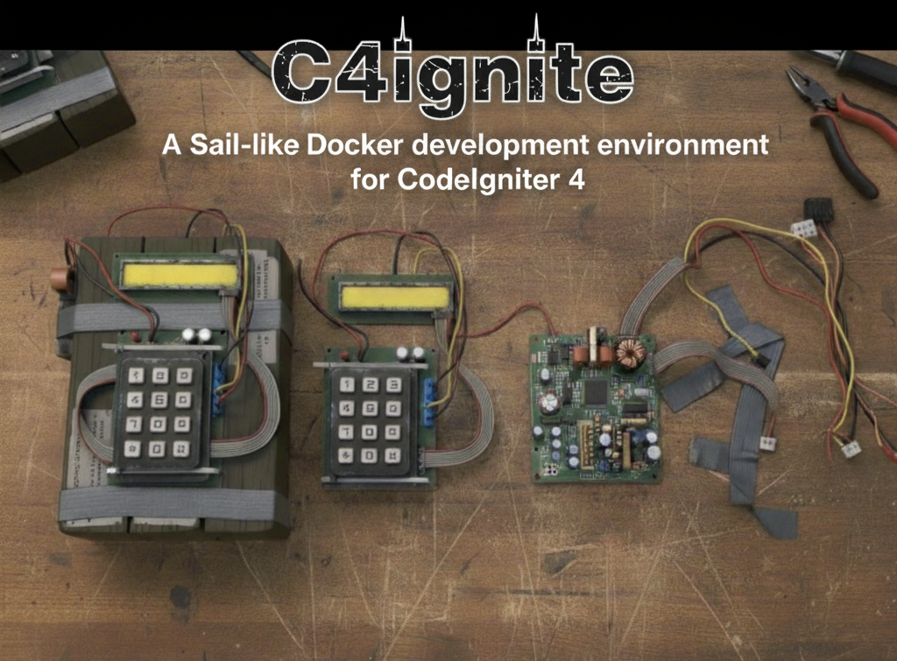

<p align="center">
  
</p>

# C4ignite — Lightweight, Modern Toolkit for CodeIgniter 4 🚀

> **Fast, Standalone Single Binary CLI & Dockerized Workflow for CodeIgniter 4** — Zero host PHP/Composer/MySQL installation required.

---

## ⚡ Quick Installation (Universal GitHub One-Liner)

Install `c4ignite` globally in seconds using our installer script:

```bash
curl -fsSL https://raw.githubusercontent.com/neflalabs/c4ignite/main/install.sh | bash
```

*Supports Linux (amd64/arm64), macOS (Intel & Apple Silicon), and Windows (WSL).*

### 🗑️ Uninstallation
To completely remove `c4ignite` from your system:
```bash
curl -fsSL https://raw.githubusercontent.com/neflalabs/c4ignite/main/install.sh | bash -s -- --uninstall
```

---

## 🛠️ Quickstart Guide

### 1. Initialize a Fresh CodeIgniter 4 Project
```bash
c4ignite init
```
*Prompt interaktif akan menanyakan nama folder aplikasi yang Anda inginkan (misal `src`, `app`, `my-project`).*

### 2. Start the Development Stack
```bash
c4ignite up
```
* Web App: [http://localhost:8000](http://localhost:8000)
* Mailhog Web UI: [http://localhost:8025](http://localhost:8025)

---

## ⚡ Daily Drivers & Ergonomics

| Action | Command |
|---|---|
| **Run Spark CLI** | `c4ignite spark make:controller Home` |
| **Database Migration** | `c4ignite migrate` |
| **Database Seeding** | `c4ignite seed UserSeeder` |
| **Interactive MySQL Shell** | `c4ignite db` |
| **Run Composer** | `c4ignite composer require <package>` |
| **Run PHPUnit Tests** | `c4ignite test` |
| **Toggle Xdebug** | `c4ignite xdebug on` / `c4ignite xdebug off` |
| **Native Encrypted Backup** | `c4ignite backup create --key=secret` |
| **OCI Multi-Stage Build** | `c4ignite build --tag=myapp:v1.0.0` |
| **Safe Production Release** | `c4ignite release` |

---

## 📘 Documentation
- [Indonesian Documentation](docs/README-id.MD)
- [Architecture & Task Evolution](TaskDev/README.md)
- [Troubleshooting](docs/troubleshooting.md)

---
<p align="center">
  <sub>Made with ☕ & 🧠 — by developers who love CodeIgniter 4</sub>
</p>
